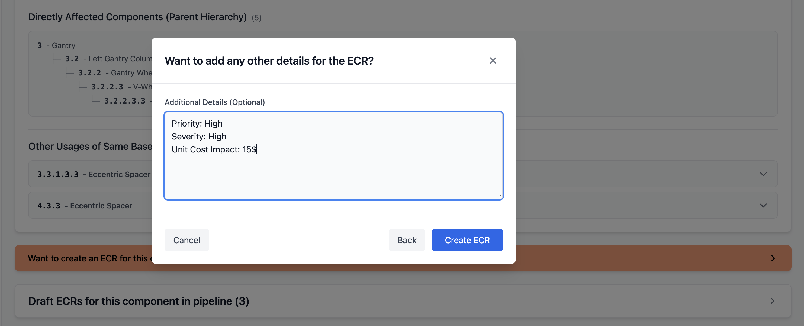
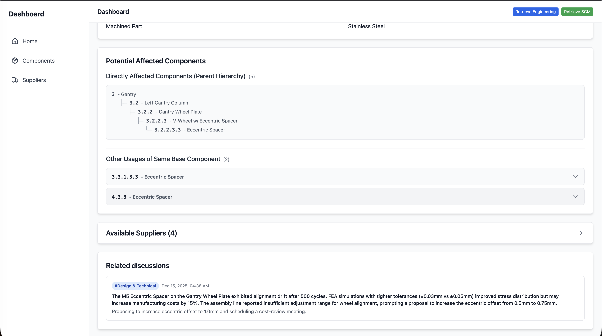

# Workflow 3 — Automatic ECR Creation from Past Component Discussions

## Problem statement
In manufacturing environments with frequent component changes, teams spend significant time documenting changes in a standardized process such as:

**ECR (Engineering Change Request) → Approval → ECO (Engineering Change Order)**

While this process improves traceability and governance, the manual effort required to write ECRs can slow teams down—especially when the information already exists in scattered discussions across Slack or other communication channels.

This workflow reduces documentation overhead by **automatically generating an ECR** using:
- Past discussions tied to a component
- Any additional structured details provided by the user (severity, priority, etc.)
- A standardized ECR template populated by AI (issue description, suggested change, affected components, etc.)

> Note: Since ECRs can have a high impact if approved, the system is currently configured to **only fill fields it is highly confident about**. This confidence threshold can be adjusted based on company policy and risk tolerance.

---

## End-to-end flow

### Step 1 — Start ECR creation from the Discussion Details page
From the component’s **Design & Technical discussion details page**, the user can click a button to create an ECR for that component (example component: **M5 eccentric spacer**).

---

### Step 2 — Select relevant discussions for the ECR context
The first dialog step lists **all discussions available for that component**.  
The user selects only the discussions that are relevant to the change request.

---

### Step 3 — Add additional structured details (priority, severity, etc.)
In the next step, the user can add extra metadata that helps the ECR be more complete and aligned with internal standards—such as:
- Severity
- Priority
- Any other required fields (based on your organization’s process)

---

### Step 4 — ECR is generated and becomes downloadable
After clicking **Next**, the ECR is created automatically using an ECR template.  
The user can:
- Review the generated ECR details
- Download the document
- See supporting context (component info, potential affected components, etc.)

---

### Step 5 — Traceability: link the ECR back to raw discussions + related context
Scrolling further shows supporting context that keeps the ECR auditable and easy to validate:
- The discussions that led to the ECR (raw source context)
- Available suppliers for the component
- Other potentially affected components

---

## Demo ECR document
A sample generated ECR document is included in the assets folder:

- `docs/assets/ecr_demo.docx`

This demo shows how the AI fills template fields based on:
- The selected discussions
- The additional details entered by the user

---

## Outcome / Why this matters
This workflow helps engineering teams move faster while preserving quality and governance:
- Reduces time spent on documentation
- Improves consistency by using a standardized ECR template
- Preserves traceability by linking back to the original discussions
- Keeps risk controlled by filling only high-confidence details (configurable)
