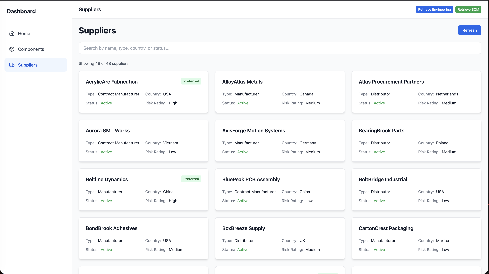
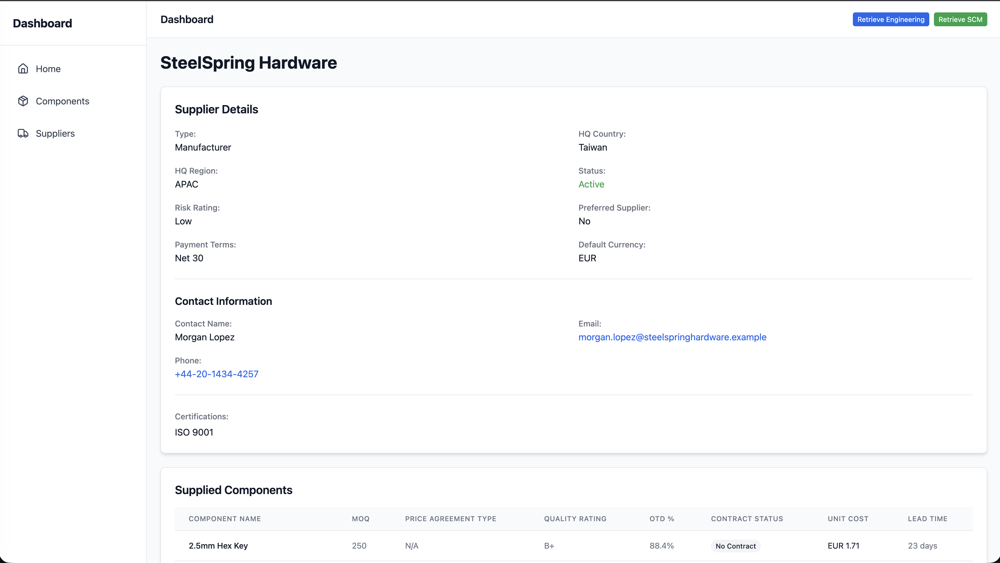
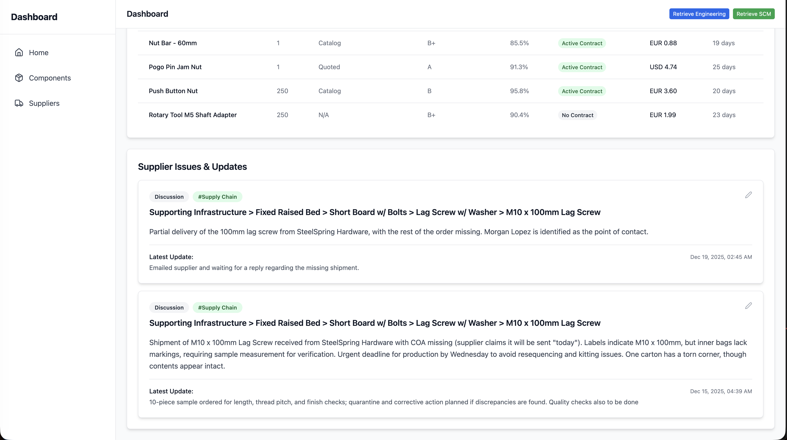

# Supplier Catalog — Searchable Supplier Repository with Parts Supplied + Discussion History

## Problem statement
Supplier knowledge is often scattered across:
- Individual notes
- Slack threads
- Informal team conversations

That “knowledge in transit” is valuable (risk signals, reliability issues, recurring delays, quality problems), but it’s hard to retrieve when procurement or engineering needs it—especially if it’s not fully captured by standard KPI dashboards.

A supplier catalog provides a central place to:
- Find suppliers quickly
- Understand what they supply
- Review supplier risk and status context
- Preserve qualitative supplier intelligence through linked discussions

---

## Solution overview
The **Supplier Catalog** is accessible from the left-side burger menu. It provides:
- A searchable directory of suppliers
- Supplier detail pages (risk, country, type, status, etc.)
- A list of components the supplier currently supplies
- A centralized discussion repository tied to each supplier for traceability and internal notes

---

## UI flow

### Step 1 — Open the Supplier Catalog and search/browse
Click **Suppliers** in the left-side menu to open the catalog.  
The search bar supports filtering/searching suppliers by:
- Name
- Type
- Country
- Status

---

### Step 2 — Open a supplier to view detailed profile information
Selecting a supplier opens the details page.  
Example: **SteelSpring Hardware**.

This view shows key supplier information such as:
- Supplier name
- Country
- Risk rating (and other profile fields)

---

### Step 3 — See what components this supplier provides
Scrolling further shows:
- The list of components that the supplier currently supplies to the company

This helps teams understand supplier coverage and component dependencies.

---

### Step 4 — Centralize supplier-related discussions and internal notes
Further down the page, users can view:
- **All discussions related to this supplier**

This consolidates qualitative supplier intelligence into one place, making it easier to:
- Spot recurring issues
- Preserve team knowledge
- Support procurement decisions with real historical context

---

## Outcome / Why this matters
The Supplier Catalog creates a centralized system for:
- Supplier discovery and evaluation
- Visibility into component dependencies by supplier
- Capturing and retaining “tribal knowledge” via supplier-linked discussions

Combined with the Components Catalog and Slack-to-summary workflows, this provides a consistent way to automatically capture knowledge in transit and map it to the right **components** and **suppliers**, keeping critical context accessible over time.
