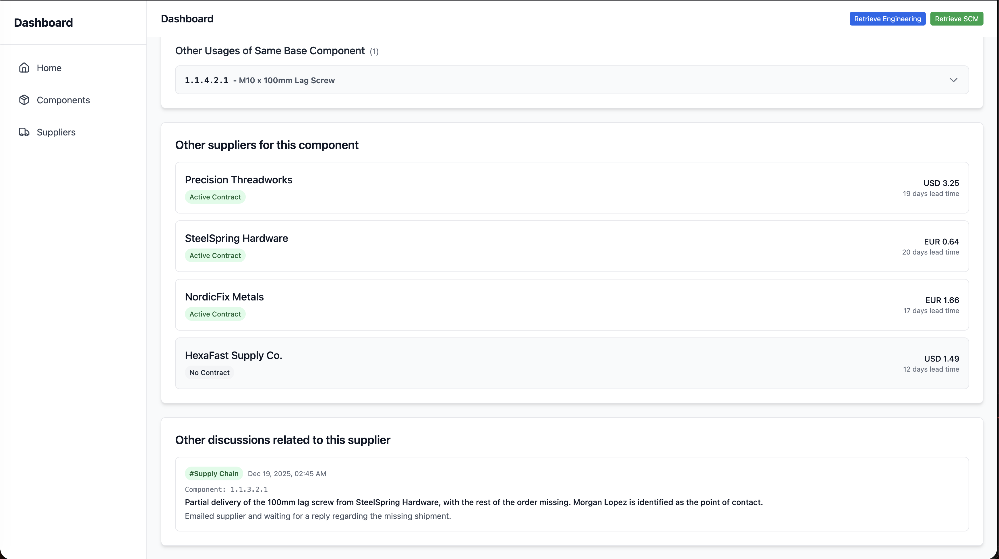

# Workflow 2 — Supply Chain Discussions → Summarized Activity Feed → Supplier + Component Context

## Problem statement
Supply chain teams often keep valuable internal notes about suppliers that don’t show up in standard dashboard metrics, for example:
- “Supplier A often delays orders.”
- “Supplier B usually has ~5% defective parts.”

These insights are critical, but they frequently remain scattered across chat threads and are hard to retrieve when decisions need to be made.

This workflow captures supply chain discussions from Slack, summarizes them, and maps them to the relevant **supplier** (and also the associated **components**) so that qualitative operational knowledge becomes accessible and actionable.

---

## Key difference vs. engineering discussions
- **Supply Chain discussions** are tagged as **Supply Chain**
- **Engineering discussions** are tagged as **Design & Technical**
- Supply Chain discussions are mapped to:
  - **Suppliers** (primary)
  - **Components** (when relevant)
- Design & Technical discussions are mapped to:
  - **Components** (primary)

---

## End-to-end flow

### Step 1 — Team discusses a supplier issue in Slack
A conversation happens between colleagues about a supplier issue (example: **SteelSpring hardware supplier**).

---

### Step 2 — Discussion is fetched, summarized, and shown in the Activity Feed
The Activity Feed automatically collects and summarizes supply chain conversations.

In this example, a discussion about the **M10 lag screw / SteelSpring Hardware suppliers** appears in the feed with:
- A concise summary
- The **latest action point** extracted from the thread  
(Highlighted as **“1”** with a green arrow in the screenshot.)

---

### Step 3 — Open the Supply Chain Discussion Details page
Clicking the discussion card opens a details view with richer context, such as:
- Supplier details
- Component details tied to the issue (if applicable)
- Additional discussion metadata

---

### Step 4 — Review impacts and alternatives
The details page also surfaces decision-support context, including:
- Potential affected components (based on analysis)
- Alternative suppliers for the same component
- Other discussions related to the supplier (historical patterns)

---

## Outcome / Why this matters
This workflow preserves qualitative supplier intelligence that typically gets lost in chat history. It creates a lightweight system where:
- Supply chain knowledge is **captured automatically**
- Supplier behavior patterns become **searchable and visible**
- Discussions are connected directly to **suppliers and components**, improving decision quality

The result is a more complete picture of supplier performance that complements dashboard metrics with real operational context.
